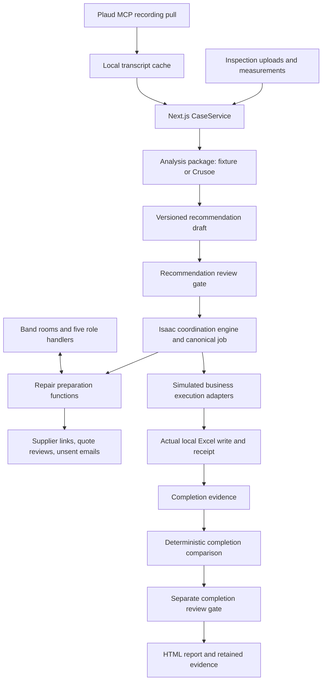
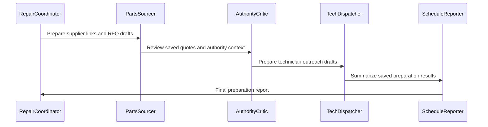

# ThermalDesk — inspection to verified repair

ThermalDesk connects inspection evidence, reviewed repair recommendations, repair preparation, scheduling, and completion review. This repository contains a local prototype with two connected pipelines. It uses **Crusoe for inference, Plaud for recorded technician evidence, and Band for communication between five repair preparation agents**.

This README describes the implementation on `codex/zubair-app-integration`, checked on **2026-09-29**. Other branches may differ. It distinguishes implemented code, recorded external integration checks, deterministic fixtures, and remaining work so that readers and AI tools can identify exactly what the application does.

**Current status:** live Crusoe inference, live Plaud intake, and live Band agent communication have each been exercised. Actual local Excel writes and report export are implemented. Supplier research links, manually entered quote review, and unsent email drafts are implemented. Actual purchasing, technician outreach, delivery confirmation, booking, and professional repair certification have not been demonstrated. The baseline execution walkthrough uses simulated business adapters and synthetic review decisions.

The intended product bridges inspection findings to verified repair execution. Product positioning and commercial demand remain working hypotheses; this repository does not establish business validation.

## Contents

- [What each integration does](#what-each-integration-does)
- [The two product pipelines](#the-two-product-pipelines)
- [Architecture and source map](#architecture-and-source-map)
- [Crusoe: inspection analysis](#crusoe-inspection-analysis)
- [Plaud: technician evidence intake](#plaud-technician-evidence-intake)
- [Band: five-agent repair preparation](#band-five-agent-repair-preparation)
- [Contracts, state, and review gates](#contracts-state-and-review-gates)
- [Excel, uploads, and reports](#excel-uploads-and-reports)
- [Run the local application](#run-the-local-application)
- [HTTP API guide](#http-api-guide)
- [Configuration and stored data](#configuration-and-stored-data)
- [Verification and recorded evidence](#verification-and-recorded-evidence)
- [Known limitations and remaining work](#known-limitations-and-remaining-work)
- [Team ownership and contribution workflow](#team-ownership-and-contribution-workflow)
- [Machine-readable integration summary](#machine-readable-integration-summary)

## What each integration does

| Integration | Implemented purpose | Evidence of operation | Boundary |
|---|---|---|---|
| Crusoe | An OpenAI-compatible inference endpoint generates structured inspection findings and a draft repair scope from supplied evidence. | Authorized image preflight and a 180-request evaluation are recorded in the integration handoff. | A provider response is a draft, not engineering approval. Current completion comparison is deterministic and does not call Crusoe. |
| Plaud | The official Plaud MCP server supplies recordings, transcripts, notes, and source identifiers. A local pull cache feeds the web application. | Ali's handoff records a live pull and physical-device recording intake. | Reading the web API does not refresh Plaud. No outbound calling is implemented through Plaud. |
| Band | The Band SDK carries room messages between five named roles; local TypeScript handlers produce preparation outputs. | A live run persisted all five roles' results and read back the final message from Band. | Band does not itself purchase parts, obtain supplier replies, or book technicians. The current preparation handlers make no model calls. |
| Excel | The application writes and reads back an actual local `.xlsx` schedule using the shared job identifier. | Offline system verification exercises workbook output and receipts. | No Microsoft 365 or cloud spreadsheet synchronization is configured. |
| Execution adapters | Isaac's coordination engine drives repair state, action receipts, retries, and failure paths. | Package tests and the integrated simulated execution walkthrough. | Purchasing, outreach, booking, and manager notifications in that walkthrough are simulated. |

Here, `live` describes the particular adapter interaction or evidence source. A live Band message carrying fictional case data remains a fictional repair. A live image upload can contain synthetic information. Neither label establishes the truth of a measurement or completion of a physical action.

## The two product pipelines

### 1. Inspection to approved recommendation

1. Collect original inspection images, equipment context, measurements, technician notes, and optional Plaud evidence.
2. Preserve source references and validate evidence identifiers, asset consistency, and missing information.
3. Analyze through a deterministic fixture adapter by default, or through Crusoe when explicitly configured and authorized.
4. Produce findings, uncertainties, missing information, and a versioned draft repair scope.
5. Present the exact recommendation version for review. Missing information remains visible.
6. Create a repair job only through the recommendation review gate.

The current application records review actions as simulated decisions. A typed reviewer name is not authentication or proof of a qualified professional's approval.

### 2. Approved repair to verified completion

1. Start from the reviewed recommendation and the job's configured authority.
2. Prepare supplier research links and RFQ drafts; capture sourced quotes for review.
3. Check exact part identity, specification, quantity, dates, currency, and planning budget.
4. Prepare availability and service-quote emails for a user-supplied technician roster.
5. In the simulated execution walkthrough, advance purchasing, delivery, and booking through labeled adapters.
6. Write the actual local Excel schedule and wait for its adapter receipt before reporting that write as successful.
7. Track execution and collect completion photos, receipts, and technician statements.
8. Compare completion evidence with the approved recommendation and job, retaining mismatches and unresolved work.
9. Submit a separate, versioned verification draft for completion review.
10. Export a report containing evidence, decisions, action provenance, and unresolved findings.

Real supplier transactions, technician attendance, and professional closure remain future integrations. The current preparation workflow stops at research, quote review, and downloadable drafts.

## Architecture and source map



| Source | Responsibility |
|---|---|
| [Application service](apps/web/lib/service.ts) | Composition, commands, review gates, and completion submission. |
| [Shared schema](contracts/v1.schema.json) | Versioned business objects exchanged between packages. |
| [Analysis entry points](packages/analysis/src/index.ts) | Inspection validation/analysis and deterministic completion comparison. |
| [Crusoe adapter](packages/analysis/src/crusoe.ts) | Provider request, timeout, output parsing, and response validation. |
| [Application analysis adapters](apps/web/lib/analysis-ports.ts) | Adapter selection, local evidence image resolution, and telemetry. |
| [Inference policy](apps/web/lib/inference-policy.ts) | Guard against unauthorized live inference requests. |
| [Plaud connector](packages/intake/src/plaud.ts) | MCP connection, recording retrieval, transcript parsing, and source mapping. |
| [Intake entry points](packages/intake/src/index.ts) | Inspection package and completion evidence assembly. |
| [Plaud web route](apps/web/app/api/plaud/route.ts) | Cached recording preview and import into the current case. |
| [Coordination engine](packages/coordination/src/engine.ts) and [repository](packages/coordination/src/repository.ts) | Canonical repair state, events, receipts, and persisted execution. |
| [Band protocol](packages/coordination/src/band/protocol.ts) | Structured room-message envelope and parsing. |
| [Band gateway](apps/web/lib/band-gateway.ts) | Configured identities, SDK connections, rooms, and dispatch tracking. |
| [Preparation crew](apps/web/lib/preparation-crew.ts) | The five application preparation role handlers and handoffs. |
| [Repair preparation](apps/web/lib/repair-preparation.ts) | Supplier links, email drafts, quotes, authority checks, and saved results. |
| [Coordination API](apps/web/lib/coordination-api.ts) | Web-facing execution and Band controls. |
| [Coordination adapters](apps/web/lib/coordination-ports.ts) | Application adapter wiring and simulation boundaries. |
| [Excel coordinator](packages/excel/src/coordinator.ts) | Schedule adapter and action receipts. |
| [Workbook implementation](packages/excel/src/index.ts) | Workbook validation, row updates, fingerprinting, and readback. |
| [Completion upload](apps/web/lib/completion-upload.ts) | Completion files, metadata, evidence versions, and validation. |
| [Report export](apps/web/lib/report.ts) | Downloadable HTML report. |
| [Frontend integration bridge](apps/web/public/mcc/js/integration.js) | Browser integration with the backend workflow. |

Detailed interfaces are in [the integration guide](docs/integration.md), [the frontend handoff](docs/frontend-handoff.md), and [the Isaac API integration guide](docs/isaac-api-integration.md). Those documents complement this overview; source code controls exact field names and current behavior.

## Crusoe: inspection analysis

### Provider and request path

Crusoe is the selected inference provider. This project calls its hosted inference API; it does not provision GPU instances. The request format is OpenAI-compatible, but the configured inference service is Crusoe.

The application chooses `FixtureAnalysisAdapter` by default. With `THERMALDESK_ANALYSIS_MODE=crusoe`, an API key, and explicit permission to enable live requests, the application wires in the Crusoe adapter. The adapter and the application fetch guard both enforce the live-request policy.

| Request setting | Current default |
|---|---|
| Base URL | `https://api.inference.crusoecloud.com/v1` |
| Endpoint | `POST /chat/completions` relative to that base |
| Authentication | `Authorization: Bearer <CRUSOE_API_KEY>` |
| Model | `nvidia/Nemotron-3-Nano-Omni-Reasoning-30B-A3B` |
| Temperature | `0` |
| Output token limit | `1024`, configurable within the adapter's accepted range |
| Timeout | `30000` milliseconds, configurable within the adapter's accepted range |
| Thinking option | `chat_template_kwargs.enable_thinking=false` by default |

An upload alone does not invoke inference. The case `analyze` command invokes the selected adapter after evidence is stored and validated.

The request includes case/site/asset context, evidence identifiers and kinds, available text and timestamps, observations, and missing information. Supported local image evidence is resolved on the server and supplied as image data URLs. The application resolver handles its own stored evidence rather than fetching arbitrary image URLs. If imported Plaud text is present, that text can be included in a later authorized Crusoe analysis request.

### Output and validation

The prompt asks for cautious findings and a repair-scope draft, with uncertainties and source evidence. It does not authorize repairs, certify safety, invent equipment specifications, or treat image color as a calibrated temperature measurement.

The expected provider payload has this shape; values below are illustrative:

```json
{
  "findings": [
    {
      "description": "A visible thermal pattern requires review with measured temperatures and equipment context.",
      "evidence_ids": ["IMAGE-001"],
      "severity": "unassessed",
      "uncertainties": ["Calibrated temperature measurements are missing."]
    }
  ],
  "repair_scope": "Collect missing measurements and obtain a qualified review before specifying repair work.",
  "missing_information": ["Measured temperatures and operating conditions"]
}
```

The adapter accepts plain or fenced JSON, removes supported thinking wrappers, checks required field shapes, and rejects references to evidence identifiers that were not supplied. The analysis package then creates the contract object with its identifier/version and no approval. The current generated recommendation contains **an empty `parts` array**; inference does not establish an approved bill of materials.

Input validation can stop inference for problems such as absent images, conflicting assets, duplicate evidence identifiers, or invalid observation references. Missing temperature measurements can permit a cautious image draft while leaving the case in `needs_information`. A supplied measurement is still user evidence, not an independent calibration check.

Timeouts, rate limits, unavailable configuration, malformed responses, and validation failures do not silently become successful recommendations. They remain recoverable failures or requests for information and do not authorize downstream execution.

### Completion comparison is a separate implementation

`compareCompletion` currently uses deterministic checks. It compares case/site/job/asset identity, the referenced recommendation version, completion evidence, reported status, and unresolved information. It can produce a mismatch, request more information, or produce a draft ready for review.

It **does not make a Crusoe request**, visually diagnose a repaired component, or establish electrical safety. A live evidence label on a comparison result describes evidence provenance; it is not proof of live model inference.

### What the recorded Crusoe evaluation proves

The authorized session on 2026-09-29 recorded one image preflight followed by 180 evaluation requests. The 180-request batch passed its provider-response, JSON-shape, known-evidence-ID, and review-gate checks; median latency was approximately 681 ms and p95 approximately 812 ms. Four local completion checks did not invoke the provider.

The evidence audit also found that **0 of the 180 outputs cited non-image evidence**, and sampled outputs omitted supplied measurements or notes. Those results establish successful transport and structural handling, not diagnostic accuracy or reliable use of every input. The evaluation saved the adapter used and its hash because the local prompt under evaluation differed from the committed version.

See [the evaluation guide](apps/web/scripts/CRUSOE-EVALUATION.md) and [Zubair's evidence handoff](docs/handoffs/zubair.md). Detailed local evaluation artifacts are intentionally not a public dataset. No further paid requests are authorized by the existence of credentials or by this README.

## Plaud: technician evidence intake

### How recording data reaches the application

The intake package connects to the official `@plaud-ai/mcp` server over stdio using the MCP client SDK. The default launch is `npx -y @plaud-ai/mcp`; the recorded live check used server version `0.3.13`. The launch command is configurable and does not pin the remotely resolved package version.

Plaud authentication is handled through that server's local login flow. Credentials do not belong in committed configuration. The connector is injectable through `PlaudToolCaller`, allowing package tests to use deterministic responses without a live account.

| MCP tool | Use in this project |
|---|---|
| `get_current_user` | Check the connected account. |
| `list_files` | Discover recordings, with supported filters and pagination. |
| `get_file` | Retrieve recording metadata. |
| `get_transcript` | Retrieve transcript blocks using the provider's `transaction` block format and cursor pagination. |
| `get_note` | Retrieve associated notes when available. |

Exports include `connectPlaudMcp`, `pullPlaudRecordings`, `listPlaudRecordings`, `fetchPlaudRecording`, `getPlaudAccount`, `plaudTranscriptInput`, `findAssetMentions`, and `parsePlaudPayload`. Pull options support explicit recording IDs, date/query filters, paging limits, known asset identifiers, and explicit file-to-asset mappings.

### Source preservation and asset association

The package preserves the provider recording identifier and a source URI such as `plaud://file/<id>#transaction`. It normalizes capture timestamps and transcript segments, including stable segment identifiers, speaker information when available, and timing converted to seconds. Provider notes and metadata can remain in the local cache.

An asset is not invented when none is supplied. Known asset mentions are matching hints, not independent identity verification. Missing transcripts are reported as skipped; authentication failures are surfaced instead of fabricated speech being substituted.

The package's inspection/completion assembly functions can retain transcript segments and source references. **The current web import has a narrower shape:** `GET /api/plaud` reads the local cache and returns previews; `POST /api/plaud` imports the selected recording's text, provider reference, source URI, and timestamp into the current case. It does not copy the full transcript segment array into case state. Preview text is limited to 2,000 characters and imported text to 20,000 characters.

The web import associates the recording with the active case asset. A user must confirm the recording belongs to that asset; asset-mention matching alone is not sufficient proof. Typed completion comments currently use an import source and are not automatically attributed to Plaud.

### Pull and optional foreground refresh

After configuring Plaud login locally:

```bash
npm run plaud:pull --workspace @thermaldesk/intake
```

To pull a specific recording with explicit demo context:

```bash
npm run plaud:pull --workspace @thermaldesk/intake -- --file RECORDING_ID --case DEMO-CASE-001 --site DEMO-SITE --asset DEMO-A
```

The resulting cache is normally `packages/intake/.plaud-pull/plaud-pull.json`, which is ignored by Git. An optional foreground watcher is available:

```bash
npm run plaud:watch --workspace @thermaldesk/intake
```

The watcher must be started separately and kept running. Its default interval is 10 seconds, with a 5-second minimum; it makes repeated provider requests and retains the prior cache on an error. It is not a deployed webhook or an automatically installed background service. Starting the web application does not start this watcher.

[Ali's handoff](docs/handoffs/ali.md) records six listed recordings, five retrieved transcripts, and one skipped recording in a live pull, plus physical-device evidence mapped into the contract. This proves intake operation, not a completed field repair. Recorded repair-completion scenarios still require their own verification.

## Band: five-agent repair preparation

### What an agent actually does here

A Band registration supplies an identity and credentials. It does not deploy or keep a worker running. In this application, the running Node.js server connects each identity through `@band-ai/sdk` and a `GenericAdapter`. Incoming room messages invoke deterministic TypeScript handlers.

The installed Band SDK version is `0.4.7`. The current preparation crew does not invoke an LLM. Its useful work is assembling source links and drafts, applying explicit quote checks, saving results, and coordinating handoffs through Band.

| Exact Band agent name | Configuration role | Implemented preparation work | What it does not establish |
|---|---|---|---|
| `RepairCoordinator` | `repair_coordinator` | Validates the approved scope context, starts the sequence, recruits roles, and receives the final report. | It does not approve a technical recommendation or invent purchasing authority. |
| `PartsSourcer` | `parts_sourcer` | Generates part-oriented supplier research links and RFQ email drafts; retains manually entered quote provenance. | It does not scrape supplier prices, request quotes by itself, or receive supplier replies. |
| `AuthorityCritic` | `authority_critic` | Checks quotes against the current scope, exact part/specification, quantity, dates, currency, and planning budget; records reasons for rejection or review eligibility. | `eligible_for_review` is not permission to purchase and is not professional engineering approval. |
| `TechDispatcher` | `tech_dispatcher` | Uses the supplied technician roster to prepare availability and service-quote email drafts. | It does not verify qualifications independently, send the email, confirm attendance, or book a job. |
| `ScheduleReporter` | `schedule_reporter` | Summarizes persisted preparation results and sends the final report back to the coordinator. | The preparation run does not change Excel or create a confirmed appointment. |

Supplier links currently include Grainger and DigiKey part searches and a McMaster-Carr catalog entry point. They are research entry points. An actual quote must be entered with its source and commercial terms before it can be evaluated.

### Handoff and persistence

The room protocol combines readable text with a fenced `thermaldesk` JSON envelope. The envelope carries message kind, job identity, and requested role/action. Preparation handoffs use `prepare:<Role>` actions. The coordinator drives the sequence, and the final report returns to it without creating a report-response loop.



The gateway verifies configured agent IDs/names and keeps credentials server-side. Messages are scoped to the persisted Band room and repair job. A room is created and saved before the crew starts subscribing, which avoids a newly created room being missed by the creator's subscription.

Dispatch intent is persisted before sending. A confirmed dispatch records the provider response. Identical saved state and preparation fingerprints are deduplicated; changed quotes, budget, or contacts produce a new intent. An uncertain pending send is retained for reconciliation rather than blindly sent again. These application checks do not claim distributed exactly-once delivery across arbitrary infrastructure.

Preparation results are bound to a fingerprint of the recommendation identifier/version, scope, parts, and approval. Changing that context invalidates prior preparation rather than silently reusing a stale result. Room mappings are stored separately from Isaac's canonical job repository.

### Quote checks and unsent email files

`AuthorityCritic` checks the current approved recommendation version, requested/offered part identity, normalized specification, explicit specification-review flags, exact requested quantity, quote expiry, delivery timing, and currency. It requires a planning budget and considers both individual quotes and the total of the cheapest matching options. A planning budget remains planning input; it does not confer purchasing authority.

Quote records include `part_id`, `offered_part_id`, `specification`, `supplier`, `quantity`, `total_minor`, `currency`, `source_url`, `valid_until`, `delivery_at`, `recorded_by`, and `recorded_at`. Money uses integer minor units. A quote source must be an HTTPS URL without embedded credentials; the application does not thereby verify the supplier's response.

RFQ and technician drafts download as `.eml` files with UTF-8 content and an `X-Unsent: 1` header. RFQs request commercial details; technician drafts request availability and a service quote. Synthetic scope context is disclosed. Downloading a draft does not send it, place an order, or instruct a technician to attend.

### Three distinct ways to exercise the workflow

| Mode | Band traffic | Business actions | Useful result |
|---|---|---|---|
| Local preparation | None | Supplier research and saved drafts only | Test preparation functions and quote review without Band credentials. |
| Live Band preparation | Actual room messages and role handoffs | Supplier research and saved drafts only | Verify five-agent transport, persistence, final reporting, and dispatch deduplication. |
| Baseline execution walkthrough | Not required | Simulated purchase/outreach/booking/notification adapters; actual local Excel adapter | Exercise the canonical job lifecycle and completion review gates. |

The original coordination package also contains execution-oriented crew handlers. The web application injects `createPreparationCrewHandler` for its live preparation workflow. Do not infer that live purchasing is configured merely because an execution action exists in Isaac's package.

### Recorded live Band result

The integrated run completed on **2026-09-29 at 22:59:41 UTC**. All five preparation roles persisted results. A matching USD 123.45 quote was eligible for review within a USD 200 planning budget; a wrong-part USD 300 quote was blocked. RFQ and technician drafts were downloaded, repeated dispatch was prevented, and the final message was read back from Band.

- Room reference: `0682bf6d-8cdf-44dc-8d00-ce1a9101a618`.
- Final message reference: `5368e901-1c23-4338-b6c3-471a335bb1fc`.
- Public description: [Zubair's handoff](docs/handoffs/zubair.md).
- Earlier package-level transport evidence: [Isaac's live Band run](packages/coordination/docs/evidence/band-live-run-2026-09-29.md).

This was a live platform run with fictional repair inputs. It sent no supplier or technician email, purchased nothing, made no booking, and made no paid inference request. The local artifact bundle contains the dispatch result, preparation state, Band transcript, and two email drafts; it is not committed as customer data.

## Contracts, state, and review gates

[The versioned JSON Schema](contracts/v1.schema.json) is the shared contract. Packages use its business vocabulary rather than competing definitions. Fixture files include demonstration data and may wrap a contract object for a scenario; callers must pass the contract data expected by the particular function.

| Object | Meaning |
|---|---|
| `InspectionPackage` | Original inspection evidence, equipment context, observations, and source references. |
| `Recommendation` | Versioned findings, repair scope, parts, missing information, and review state. |
| `RepairJob` | Canonical execution state associated with the approved recommendation. |
| `CompletionEvidence` | Versioned completion material tied to the case, job, and asset. |
| `VerificationDraft` | Comparison result and unresolved work awaiting separate closure review. |
| `ActionReceipt` | Evidence of an attempted adapter action, its mode, result, and provider reference where applicable. |

Isaac's coordination service owns canonical repair state and execution transitions. The application may store preparation metadata, but it must not treat that metadata as an alternative job state machine.

The recommendation gate approves an exact recommendation version. The completion gate separately binds the verification to the relevant recommendation and completion-evidence versions. Changing evidence requires fresh comparison/review rather than retaining an obsolete closure decision.

The current `approve_scope` and `approve_closure` application actions are simulated review decisions. Fixtures with an approval field are synthetic fixtures. Neither is a credentialed professional's sign-off.

Purchasing or booking requires an approved job and applicable, unexpired configured authority. Routine in-scope actions should use that authority; missing or insufficient authority must be surfaced. An action is not confirmed simply because an instruction was generated. The engine must retain adapter results and any required external confirmation.

Job identifiers and idempotency keys are persisted for execution actions. Retries must reuse their action identity instead of creating duplicate orders, bookings, or notifications. The application currently permits actual local workbook actions through its workbook capability; business execution adapters remain simulated.

## Excel, uploads, and reports

### Actual local workbook output

The workbook adapter writes a real `.xlsx` file. The schedule columns are `job_id`, `asset_id`, `site_id`, `technician_id`, `technician_name`, `start_at`, `end_at`, `parts_status`, `job_status`, and `last_updated_at`.

Rows are keyed by job ID. Updates use the expected SHA-256 workbook fingerprint, a cooperating lock, a temporary save, readback, replacement, and final verification. A hidden receipt sheet supports idempotency. Conflicting fingerprints and unsupported target-cell formulas are rejected instead of silently overwritten.

This is a local plain-workbook integration, not a guarantee of preserving arbitrary macros, pivot tables, or complex user workbooks. A scheduling event or proposed appointment does not itself prove a workbook update; the receipt and readback do.

### Inspection and completion evidence

Inspection uploads accept supported PNG/JPEG, PDF, and text inputs with size and signature checks. Files receive local evidence identifiers; supported PDF ingestion renders up to the first three pages for image evidence. Text containing a numeric value and temperature unit may become measurement evidence, but that classification does not validate the measurement instrument or provenance.

Completion upload accepts one to six files with an 8 MB combined limit, together with the expected revision, technician/asset identity, reported status, and comments. A document-kind option can identify receipt evidence. Wrong-asset material is preserved for mismatch handling rather than silently reassigned. New completion evidence advances its version and invalidates a stale verification result.

The backend completion route and the frontend completion controls must be assessed separately; a backend test does not prove every visual control is wired correctly.

### Report export

The report endpoint returns downloadable HTML containing available evidence references, findings, uncertainty, decisions, job events, adapter outcomes, and completion review information. It can describe an incomplete case; exporting it does not certify closure. Browser printing can produce a PDF, but there is no dedicated server PDF-export endpoint in this workflow.

## Run the local application

Use a supported Node.js runtime: the root workspace requires Node 22 or newer and the intake package requires at least 22.6. Install dependencies from the checked-in lockfile.

```bash
git clone https://github.com/zubair480/crusoe-hackathon.git
cd crusoe-hackathon
git switch --track origin/codex/zubair-app-integration
npm ci
npm run dev
```

Use `git switch codex/zubair-app-integration` if that local branch already exists. Use a separate checkout when another teammate is actively using the directory.

Open the server URL printed in the terminal. The default development port is 3000. To use the port shown in the integrated workbench demonstration:

```bash
npm run dev --workspace @thermaldesk/web -- --port 3001
```

The preparation workbench is available at `/api/preparation/workbench`. For a production build of the local prototype, use `npm run build`, followed by `npm start`.

Review [the web environment example](apps/web/.env.example) before configuring the application. Preserve an existing local environment file and its secrets. Default development settings are:

```dotenv
THERMALDESK_ANALYSIS_MODE=fixture
CRUSOE_LIVE_REQUESTS_ENABLED=false
```

The ordinary local workflow requires no paid inference request. Starting the server does not automatically start Band workers or a Plaud watcher. A live Band operation requires configured identities and an explicit live opt-in. A live Crusoe run requires separate authorization to spend, the provider configuration, and the enforced live-request flag. Consult the evaluation guide before any paid test.

## HTTP API guide

These routes belong to the local prototype. They do not provide production authentication or tenant isolation. The origin guard protects selected mutations but is not user identity verification. Use the current `expectedRevision` for case mutations and refresh state after a `409` conflict instead of resubmitting an old revision blindly.

| Method and route | Purpose and important behavior |
|---|---|
| `GET /api/health` | Report local integration configuration. A cached or configured status is not a fresh remote health test. |
| `GET /api/case` | Read the current case and revision. |
| `POST /api/case` | Execute a case command with `command`, `expectedRevision`, and command-specific values such as reviewer information. |
| `POST /api/evidence` | Upload inspection evidence as multipart form data. |
| `GET /api/evidence/<id>` | Retrieve stored local evidence. Treat the running server and files as private local data. |
| `GET /api/plaud` | Preview the most recent locally cached Plaud recordings. Does not pull from Plaud. |
| `POST /api/plaud` | Import a cached `recording_id` using the current `expectedRevision`. |
| `GET /api/preparation` | Read preparation results, saved quotes, contacts, budget, and role progress. |
| `POST /api/preparation` | Run preparation or change its inputs using the supported command and current revision. |
| `GET /api/preparation?draft=rfq&id=<part-id>` | Download a prepared supplier RFQ email file. |
| `GET /api/preparation?draft=technician&id=<contact-id>` | Download a prepared technician email file. |
| `GET /api/preparation/workbench` | Open the preparation workbench. |
| `GET /api/coordination` | Inspect local coordination/Band status without making remote identity calls. |
| `POST /api/coordination` | Check configured identities, start/stop workers, dispatch preparation, or submit supported execution events. Live start/dispatch uses `allowLiveBand: true`. |
| `POST /api/completion` | Upload versioned completion files and statements as multipart form data. |
| `GET /api/schedule` | Download the actual local workbook; absent before the first successful write. |
| `GET /api/schedule?format=json` | Read schedule rows and the current workbook fingerprint. |
| `GET /api/report` | Download the current HTML report, including incomplete or simulated state. |

For exact command lists, multipart field names, response envelopes, and error codes, use [the frontend API handoff](docs/frontend-handoff.md), [Isaac integration notes](docs/isaac-api-integration.md), and the route implementations. The coordination event endpoint does not bypass the recommendation or closure gates.

An illustrative case analysis request is:

```json
{
  "command": "analyze",
  "expectedRevision": 3
}
```

Read the actual revision first. With default configuration this uses fixture analysis; changing the request body does not override the server's live-inference policy.

## Configuration and stored data

| Setting | Purpose/default |
|---|---|
| `THERMALDESK_ANALYSIS_MODE` | `fixture` by default; `crusoe` selects the provider adapter. |
| `CRUSOE_LIVE_REQUESTS_ENABLED` | Keep `false` unless a new live request is explicitly authorized. |
| `CRUSOE_API_KEY` | Server-side inference credential; never commit or expose it to the browser. |
| `CRUSOE_BASE_URL` | Provider API base, defaulting to the Crusoe inference URL above. |
| `CRUSOE_MODEL` | Provider model identifier. |
| `CRUSOE_TIMEOUT_MS` | Request timeout, default 30000; accepted range 1–120000. |
| `CRUSOE_MAX_TOKENS` | Output token limit, default 1024; accepted range 1–4096. |
| `CRUSOE_ENABLE_THINKING` | Optional provider thinking setting; false by default. |
| `THERMALDESK_ARTIFACT_DIR` | Override local runtime storage; otherwise resolved from the process working directory under `artifacts/thermaldesk-demo`. |
| `THERMALDESK_DEV_FRONTEND_ORIGINS` | Additional permitted development frontend origins. This does not enable authentication. |
| `BAND_AGENT_CONFIG` | Path to local Band role configuration; default is the coordination package's ignored `agent_config.yaml`. |
| `PLAUD_MCP_COMMAND` | MCP server launch executable, default `npx`. |
| `PLAUD_MCP_ARGS` | MCP launch arguments, default `-y @plaud-ai/mcp`. |
| `PLAUD_WATCH_INTERVAL_MS` | Optional foreground pull interval, default 10000 with a minimum of 5000. |

Store each Band role's assigned agent ID and API key only in the ignored local configuration. Use the exact five names documented above. Do not paste credential values into a README, a handoff, logs, fixture files, browser code, or another teammate's branch.

Runtime storage includes case state, local evidence, canonical coordination data, workbook output, preparation results, and Band room/dispatch metadata. The precise artifact directory depends on the process working directory; workspace npm commands commonly run with `apps/web` as that directory. Inspect configuration before assuming two server processes share the same data.

Plaud's pull cache is separate under the intake package. Inference telemetry records operation/case identifiers, provider/model/request identifiers, latency, token usage, and error metadata; it does not intentionally log request bodies, image bytes, transcript bodies, or API keys. Preserve raw evidence privately rather than treating ignored artifacts as a public test dataset.

Health values require interpretation: Crusoe can be simulated, live-disabled, configured-but-unverified, or unconfigured; Plaud can report a live-pulled cache without proving current account connectivity. Baseline coordination may still report simulated execution while Band preparation is connected. Use the coordination endpoint and actual receipts to inspect that separate activity.

## Verification and recorded evidence

### Default local checks

```bash
npm test
npm run typecheck
npm run build
npm run test:system
```

The system runner uses a separate temporary artifact directory and a bounded local server, forces fixture analysis and disabled live Crusoe requests, and shuts down after verification. It exercises the integrated demo without altering the ordinary case store. It is defined in [the system test runner](scripts/system-test.mjs).

The recorded full package suite before the latest Band fix passed 90 tests. After the fix, 13 focused tests, type checking, a build, and system verification passed. These are recorded runs, not a claim that every later local change has received the same full suite. The build also reported a Plaud file-tracing warning; deployment packaging needs its own check.

### Optional external integration checks

The explicitly authorized Band system check is:

```bash
npm run test:system -- --live-band
```

This creates actual Band traffic using fictional case data. It requires local credentials and a deliberate decision to exercise the service. The runner records dispatch/preparation/transcript evidence and downloads drafts before shutting down its local connections. It is not the default offline test path.

Crusoe verification and evaluation tools enforce both the live environment flag and a billable-request opt-in. See [CRUSOE-EVALUATION.md](apps/web/scripts/CRUSOE-EVALUATION.md), [the evaluation runner](apps/web/scripts/crusoe-eval.mjs), and [the preflight verifier](apps/web/scripts/verify-crusoe.mjs). Existing credentials are not permission to spend. No live provider check is required for documentation-only changes.

### Where to find evidence

| Evidence | Location and interpretation |
|---|---|
| Current integration status and recorded runs | [Zubair's handoff](docs/handoffs/zubair.md). Includes boundaries and remaining issues. |
| Plaud owner verification | [Ali's handoff](docs/handoffs/ali.md). Read its live/fixture distinctions. |
| Coordination package live transport | [Band run evidence](packages/coordination/docs/evidence/band-live-run-2026-09-29.md). Live transport does not imply real business execution. |
| Reproducible system workflow | [System runner](scripts/system-test.mjs) and [application smoke runner](apps/web/scripts/smoke.mjs). |
| Detailed Crusoe evaluation | Local ignored `artifacts/crusoe-evaluation/2026-09-29T22-43-15-643Z/`; includes saved adapter/hash, request records, summaries, and audit output. |
| Detailed integrated Band preparation | Local ignored `artifacts/band-preparation-run-1790722764703/`; includes result, dispatch, preparation, transcript, and email draft files. |

Local artifact paths document the recorded developer session; a fresh clone will not contain those private files. Public handoffs summarize their findings. No single real field case has yet demonstrated real inspection evidence, actual procurement and technician work, and qualified final certification from end to end.

## Known limitations and remaining work

1. **Professional decisions are simulated.** Production identity, qualification checks, and independently recorded professional review must replace demonstration review actions before real technical approval is claimed.
2. **Quotes are entered by an operator.** Supplier links and RFQ drafts work; automatic quote collection and supplier-response ingestion are not implemented.
3. **Outreach is unsent.** Technician contact details come from supplied input. No actual email delivery, telephone call, qualification check, or confirmed booking follows from generating a draft.
4. **Business execution is simulated.** Real purchasing, delivery confirmation, booking, and manager notification need authorized adapters with durable external receipts.
5. **Crusoe evidence use needs improvement.** Structural evaluation passed, but non-image evidence citation failed across the recorded batch. Diagnostic accuracy, calibrated measurement interpretation, and completeness are not established.
6. **No inferred bill of materials.** The current Crusoe analysis wrapper emits no parts. Preparation needs reviewed part requirements from the approved scope; do not invent them from model prose.
7. **Completion comparison is deterministic.** It catches identity/version/evidence problems but does not perform live visual repair verification or certify safe equipment operation.
8. **Plaud web imports flatten transcripts.** The connector can preserve segments; the current case import does not retain the complete segment array. The web endpoint reads a cache and needs a separate refresh process.
9. **Frontend demonstrations need careful interpretation.** Current frontend context generation includes simulated temperatures/load values and palette-based estimates. These are not calibrated inspection measurements or proof of standards compliance.
10. **The UI can reset a demo case.** The current frontend analysis flow can reset prior recommendation/job state before starting another inspection. Preserve reports/evidence before using a disposable demo again. Backend upload restrictions and frontend reset behavior are separate concerns.
11. **The runtime is local and stateful.** There is no production authentication, tenant isolation, distributed queue, managed worker deployment, or multi-case service guarantee. Band workers need the hosting process to remain active.
12. **Workbook and UI integration have limits.** Excel support targets the local schedule format; cloud sync and arbitrary complex workbooks are unsupported. Completion backend validation does not establish that Claude's final visual controls have all been connected.

These boundaries should remain visible in demonstrations and in AI-generated descriptions of this project. Sponsor eligibility and submission requirements are tracked separately in [the prize audit](docs/prize-audit.md); integration code alone does not establish award eligibility.

## Team ownership and contribution workflow

| Owner | Working branch | Responsibility |
|---|---|---|
| Zubair | `codex/zubair-app-integration` | Next.js APIs and application integration, Excel, reports, shared contracts, root configuration, and lockfile. |
| Isaac | `codex/isaac-repair-coordination` | `packages/coordination/`, canonical repair state, execution events, adapter actions, and coordination. |
| Sunny | `codex/sunny-crusoe-analysis` | `packages/analysis/`, Crusoe, input validation, recommendation drafts, and completion comparison. |
| Ali | `codex/ali-plaud-intake` | `packages/intake/`, Plaud, inspection intake, and completion evidence collection. |
| Claude | Frontend work discovered through pushed branches/commits | Visual UI, Three.js scene, and components; coordinate interfaces through the frontend handoff. |

Read [AGENTS.md](AGENTS.md), [product scope](docs/product-scope.md), [integration rules](docs/integration.md), [the schema](contracts/v1.schema.json), your role prompt, relevant fixtures, [team coordination](docs/team-coordination.md), and [the prize audit](docs/prize-audit.md) before implementation.

Role prompts: [Zubair](docs/prompts/zubair.md), [Isaac](docs/prompts/isaac.md), [Sunny](docs/prompts/sunny.md), and [Ali](docs/prompts/ali.md).

At startup, read pushed teammate handoffs:

```bash
python scripts/team_status.py
```

Each person works in their own checkout/branch and updates their own handoff after milestones, immediately on a blocker, before pausing, and roughly every ten minutes of active work. Include UTC time, latest pushed implementation commit, interfaces, checks performed, actual integration modes, and named dependency requests. This does not imply an idle background update service.

Export callable TypeScript package functions and inject adapters for deterministic fixtures. Preserve the shared contract and source evidence. Coordinate shared contract changes through Zubair; do not silently change another package's assumptions or overwrite a teammate's work. Add relevant tests inside the owned package and keep real secrets out of Git.

Open a pull request into `main` after verification. Do not merge or force-push teammates' work without coordination. Both complete pipelines, including cancellation, missing evidence, mismatched evidence, and retry behavior, must remain in scope. See [the inspection fixture](fixtures/inspection.json) and [the synthetic approved recommendation](fixtures/approved-recommendation.json) for a starting demonstration.

## Machine-readable integration summary

The following summary is intended for repository-reading AI tools. It describes the checked implementation and recorded evidence, not a live health response or a promise about future branches.

```json
{
  "project": "ThermalDesk",
  "repository": "zubair480/crusoe-hackathon",
  "documented_branch": "codex/zubair-app-integration",
  "checked_on": "2026-09-29",
  "deployment_status": "local_prototype",
  "crusoe": {
    "purpose": "draft_inspection_analysis",
    "transport": "openai_compatible_chat_completions",
    "live_requests_recorded": true,
    "default_development_mode": "fixture",
    "approves_repairs": false,
    "used_by_current_completion_comparison": false,
    "diagnostic_accuracy_established": false
  },
  "plaud": {
    "purpose": "recorded_technician_evidence",
    "transport": "plaud_mcp_over_stdio",
    "live_pull_recorded_in_owner_handoff": true,
    "web_api_reads_cached_pull": true,
    "outbound_calling": false,
    "web_import_preserves_full_segment_array": false
  },
  "band": {
    "purpose": "five_role_repair_preparation_handoffs",
    "transport": "band_sdk_room_messages",
    "live_preparation_handoff_verified": true,
    "current_handler": "createPreparationCrewHandler",
    "role_execution": "deterministic_typescript_functions",
    "model_calls_in_preparation_crew": false,
    "supplier_quotes": "operator_entered_with_source",
    "outreach": "unsent_eml_drafts",
    "real_purchasing_or_booking": false
  },
  "excel": {
    "actual_local_xlsx_write_and_readback": true,
    "cloud_spreadsheet_sync": false
  },
  "review": {
    "recommendation_and_completion_gates_are_separate": true,
    "app_review_decisions_are_simulated": true,
    "real_repair_certification_demonstrated": false
  }
}
```
